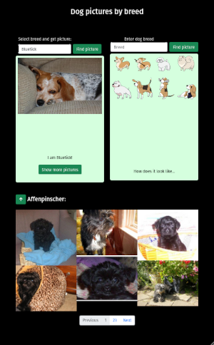

# 🪧 Using API

## 📋 About

2023-02-22 homework.

Learning fetch and use data from external API
**API used**: [https://dog.ceo/](https://dog.ceo/)

🌐 **Site published at**: [https://codevivi.github.io/using-api](https://codevivi.github.io/using-api)

🎯 **Goals:**

- [x] Search dog picture by breed input. If no picture found, return 'Nuotrauka nerasta' message; If input field is empty, do not search.[https://dog.ceo/dog-api/breeds-list](https://dog.ceo/dog-api/breeds-list)
- [x] Create picture gallery (3 columns) using code form before; [https://dog.ceo/dog-api/documentation/breed](https://dog.ceo/dog-api/documentation/breed)
- [x] Create select input with options for all breed names. When option selected, return picture. Correctly return picture with two words breed name.
